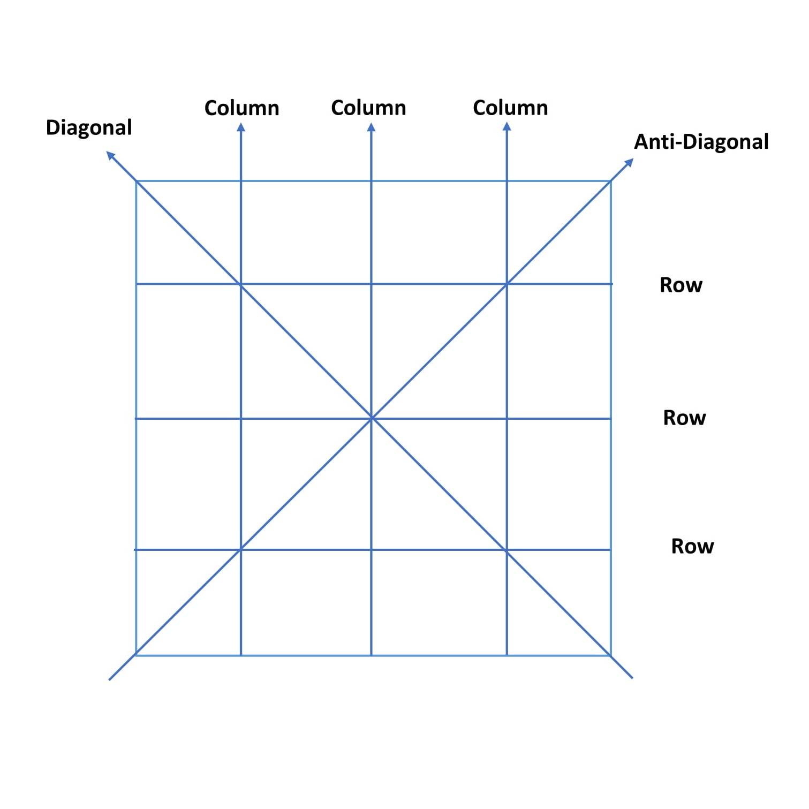
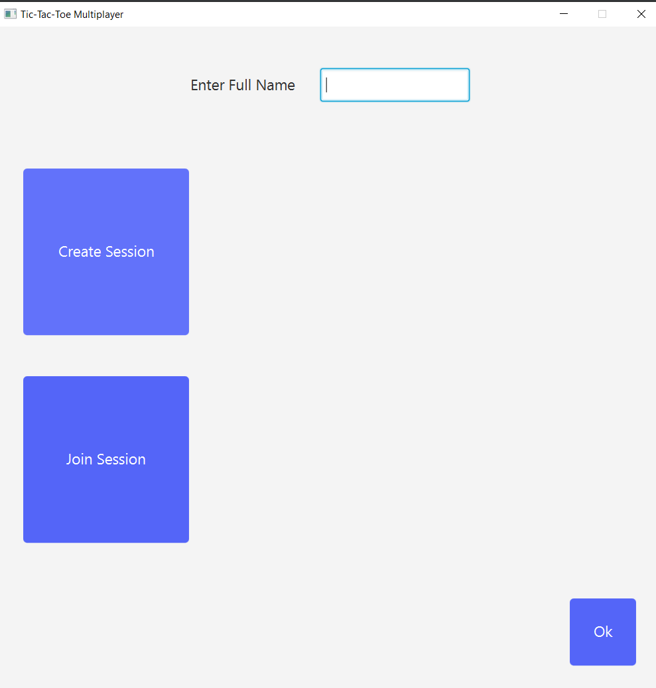
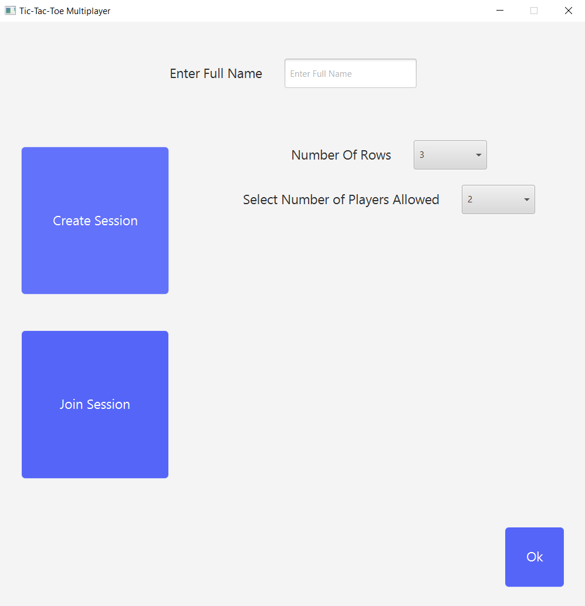
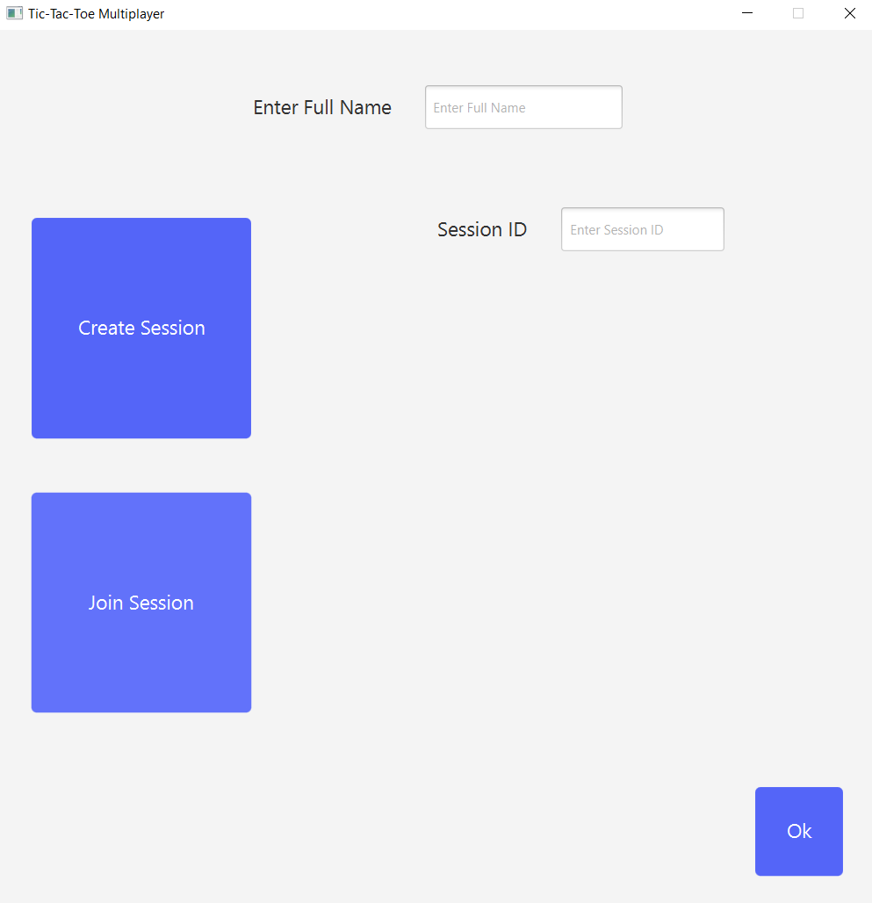
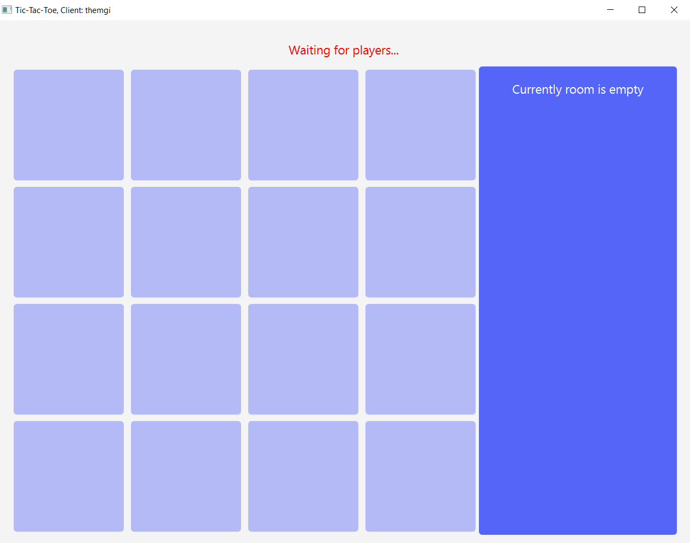
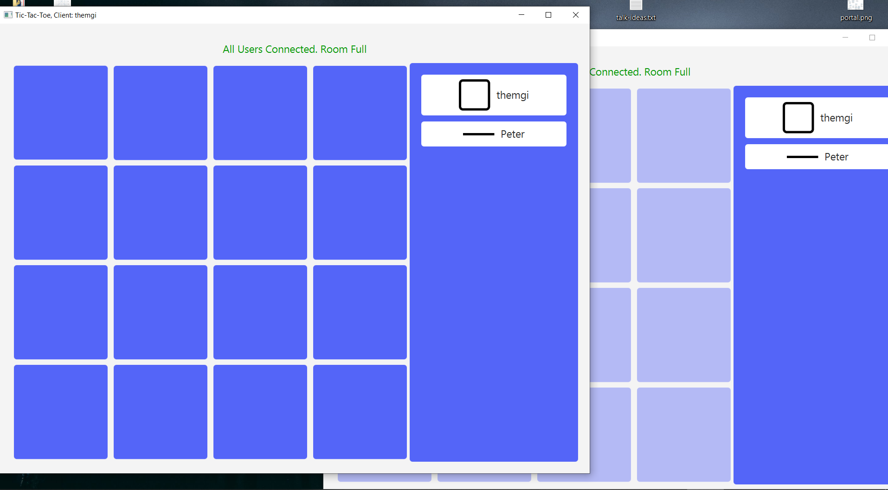
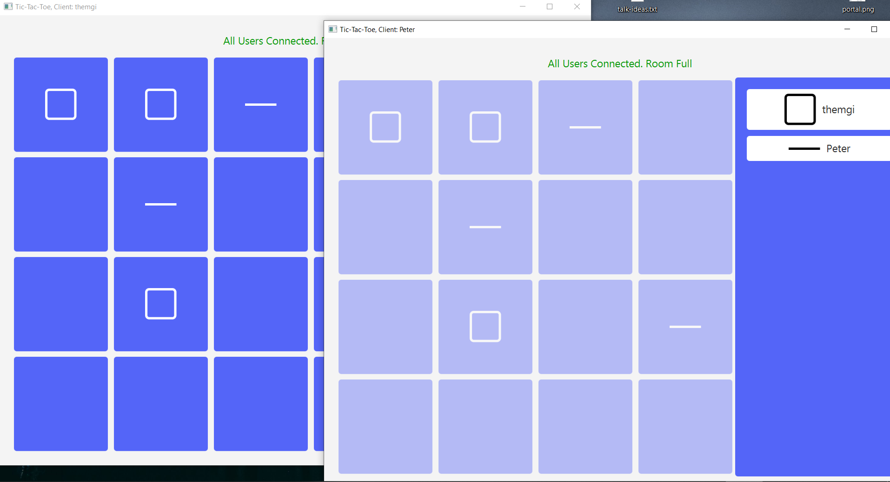
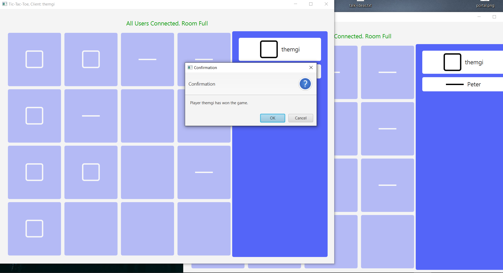

# Multiplayer Tic-Tac-Toe Game over LAN
**_Any feedback will be highly be appreciated_**

**_In case of queries, feel free to ask :)_**

Got an idea of making of simple Tic-Tac-Toe game on the console, but though why not make one, which me and my homies can play on the network so here it is.

### Video Link
[Youtube Video Link](https://youtu.be/uYjBWZkFm44)

This project contains a server and a client. Client initiates the sessions, other players can join the sessions and play the game. A Server which keeps the record of all server sessions and each single session will hold the data of all the users that belongs to it.

This game involves the following functionality:
1. Players can either create {ROOMS or SESSIONS} or JOIN_SESSIONS
2. While a session is being created, players can specify how many rows they want or to how many players they want to
allow to join the session at MAX
3. Players can join sessions of other users if they have available space, or their request will be denied by the server.
4. Winning conditions:
    1. ROW Match
    2. COLUMN Match
    3. Diagonal Match
    4. AntiDiagonal Match
       
       
## How to Run
1. First of all, server needed to be running, therefore, navigate to the `src/jar-file` folder, start terminal in the directory and type `java -jar ServerHandler.jar`, it will start the server
2. Now to run the client, navigate to the `src/jar-file`, start terminal in the directory and type `java --module-path PATH_TO_LIB_FOLDER_JAVAFX_SDK --add-modules javafx.controls,javafx.fxml,javafx.graphics,javafx.web -jar tic-tac-toe.jar`, this will start your client.
3. Next the application is self-explanatory, you'll know what to do next.
4. In case if you want to run in over multiple systems over the LAN, you need to do some tweaks in the code
    1. Navigate to `src` folder, in `Client` class at `line 64` you need to change the `localhost` to the local address of your server something like `192.168.0.18`.
    2. Then, it is up to you to build it again or run it from the IDE itself.

## Screenshots

